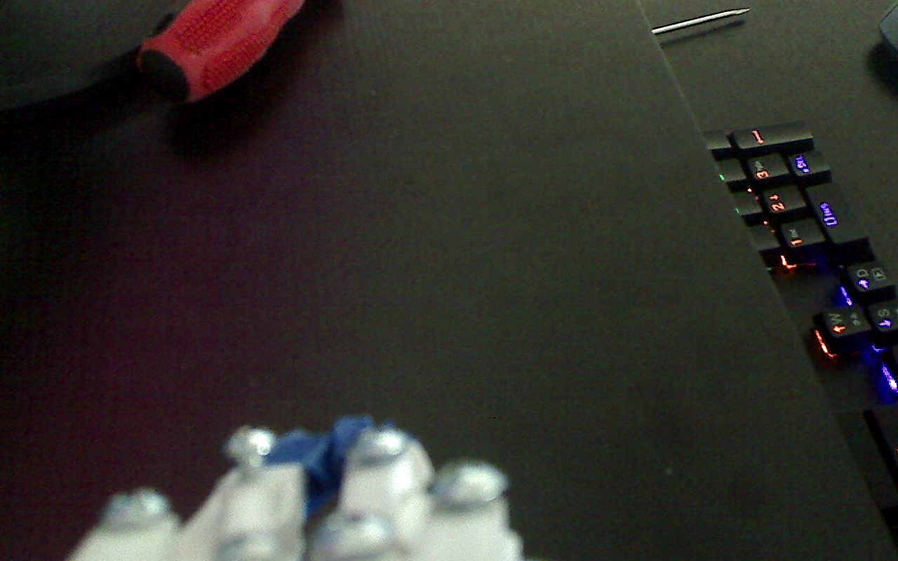
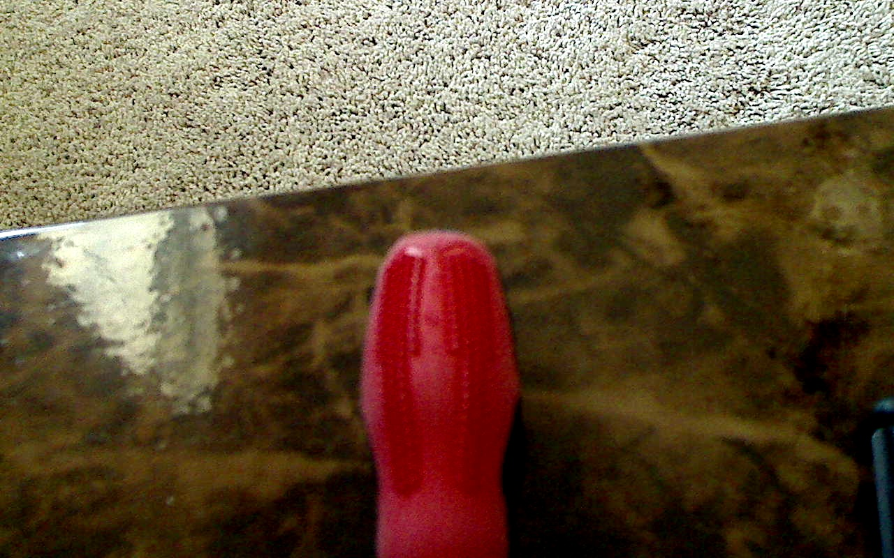
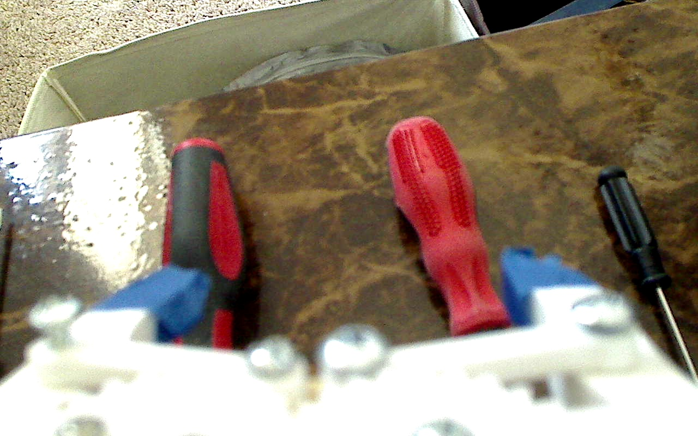
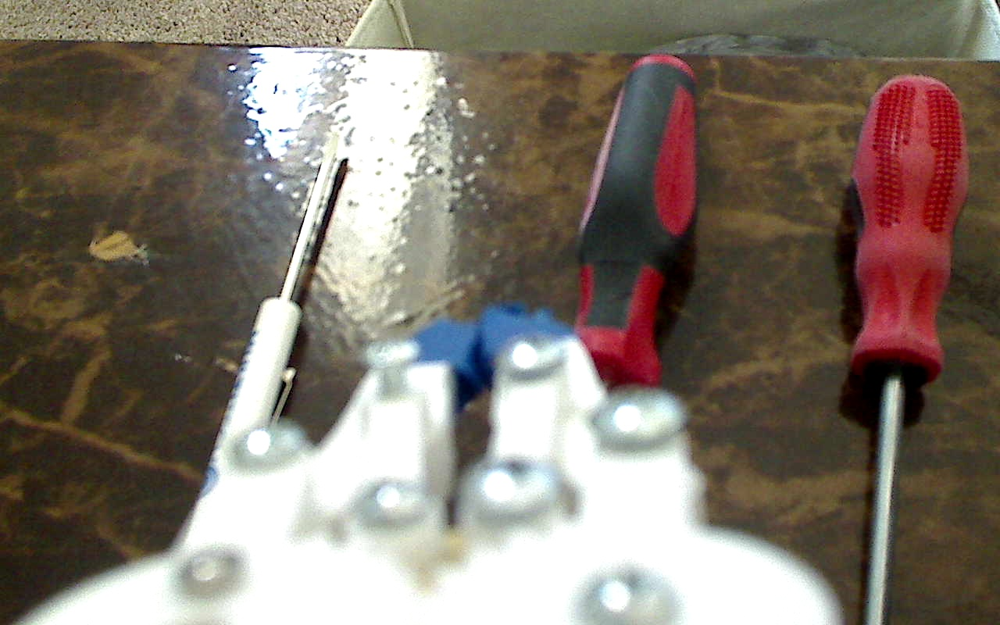
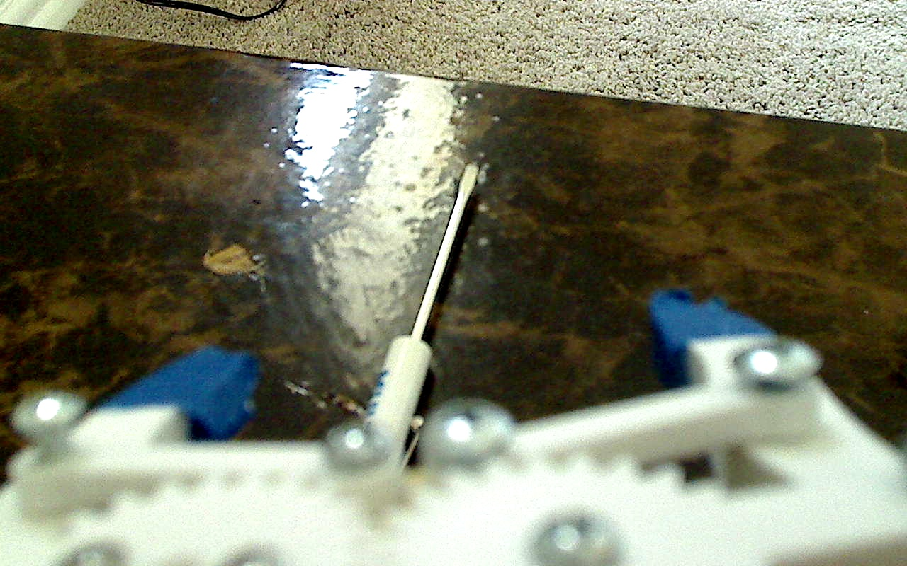
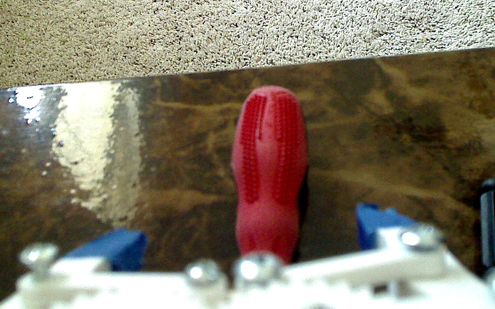
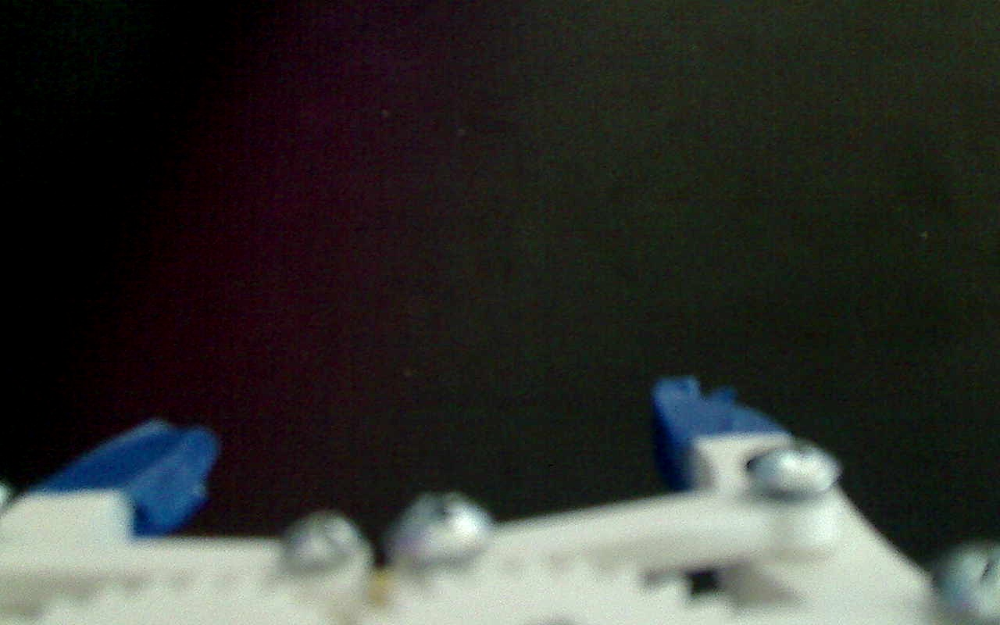
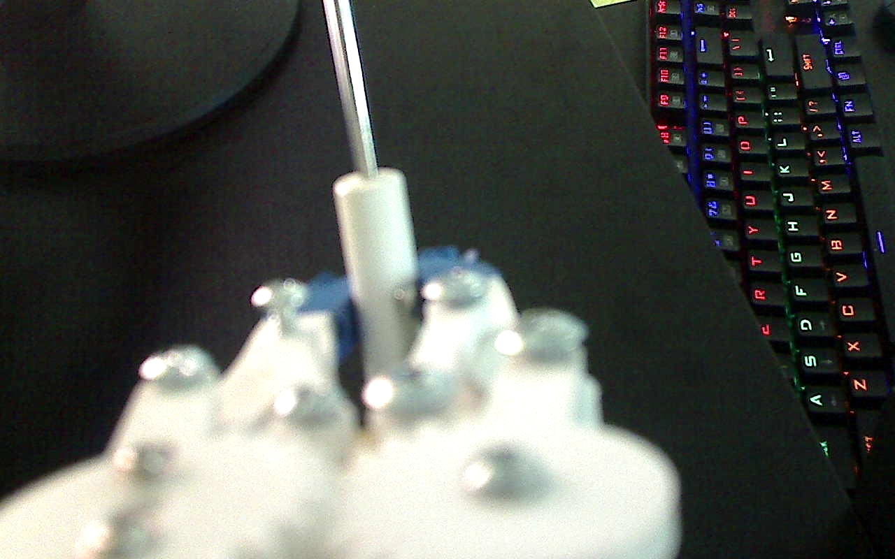
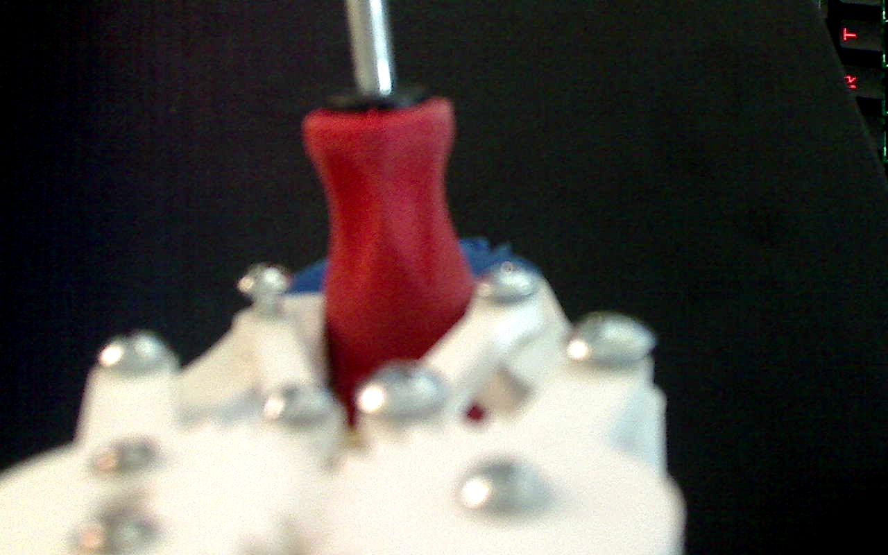

## Aim
 - Determine if gripper picked up object

## System
- Inputs
  - JPG Image matrix
- Outputs
  - Gripping object
  - Not gripping object

## Gripper States
 1. Open
 2. Closed
  - Succeeded in pick up
  - Failed in pick up
 3. Unknown (gripper out of scene)

## Potential Roadblocks

* Gripper must be in the scene when executing grasp
* Grasp may be identified too early
* Grasp may be incorrectly identified due to depth illusion as only single camera is used

## Data Generation
* The following are file prefixes for a variety of different situations that I could think of for each 
state outcome of the CNN, there are around 1000 images for each of the file prefixes shown below

1. Types of images generated for failed picks
 - 
 - 
 - 
 - 
 - 
 - 
 - 

2. Types of images generated for succesful picks
 - 
 - 
